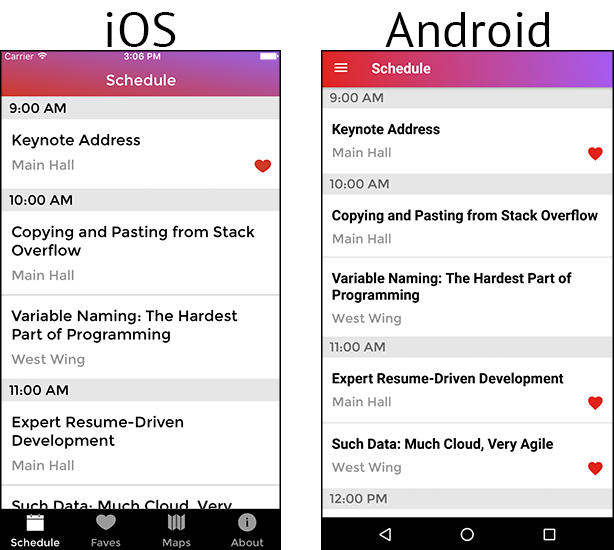

# Project - R10

  Ï

---

## Installation
### iOS
<a href='https://developer.apple.com/xcode/'>Install Xcode</a>

`> yarn`

`> react-native link`

`> react-native start`

`> react-native run-ios`

### Android
<a href='https://facebook.github.io/react-native/releases/0.23/docs/android-setup.html'>Instructions for setting up Android emulators here</a>

`> yarn`

`> react-native link`

`> react-native start`

`> react-native run-android`

## Summary
R10 is a mock developer conference app which pulls information about upcoming conference sesssions and their speakers from a Firebase api.  App user from both Android and iOS can then use the app to view the conference schedule, add sessions to their favourites, view the speaker of the sessions and view the speakers Wikipedia page.

## Javascript Technologies and Libraries Used
- React
- React-Native
- Redux
- ExNavigation
- Momentjs

## Other Technologies
- Realm Local Database
- iOS simulator
- Android Virtual Device (AVD) and Android emulator